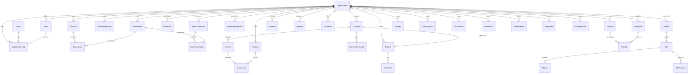

# Ledgerline ERD

```mermaid
erDiagram
  Organization ||--o{ OrgMembership : has
  Organization ||--o{ Role : defines
  User ||--o{ OrgMembership : joins
  Role ||--o{ OrgMembership : grants

  Organization ||--o{ Account : owns
  Organization ||--o{ JournalEntry : posts
  Account ||--o{ JournalLine : contains
  JournalEntry ||--|{ JournalLine : balances
  Organization ||--o{ AccountingPeriod : controls

  Organization ||--o{ BankConnection : connects
  BankConnection ||--o{ BankTransaction : imports
  JournalEntry ||--o{ BankTransaction : matches
  Organization ||--o{ BankRule : automates

  Organization ||--o{ Customer : serves
  Organization ||--o{ Product : sells
  Customer ||--o{ Invoice : receives
  Invoice ||--|{ InvoiceLine : includes
  Product ||--o{ InvoiceLine : priced
  Customer ||--o{ PaymentReceived : pays
  Organization ||--o{ RecurringTemplate : schedules

  Organization ||--o{ Vendor : buys_from
  Vendor ||--o{ Bill : sends
  Bill ||--|{ BillLine : includes
  Organization ||--o{ Expense : records
  Bill ||--o{ BillPayment : paid_by

  Organization ||--o{ TaxRate : configures
  Organization ||--o{ TaxReturn : files

  Organization ||--o{ Employee : employs
  Organization ||--o{ PayRun : runs
  PayRun ||--o{ Payslip : generates
  Employee ||--o{ Payslip : receives

  Organization ||--o{ Project : tracks
  Project ||--o{ TimeEntry : logs
  Customer ||--o{ Project : sponsors

  Organization ||--o{ Budget : plans
  Organization ||--o{ AuditLogEntry : audits
  Organization ||--o{ Attachment : stores
  Organization ||--o{ Notification : alerts
  Organization ||--o{ SavedReport : saves
  Organization ||--o{ Integration : connects
  Organization ||--o{ ExchangeRate : rates
```
